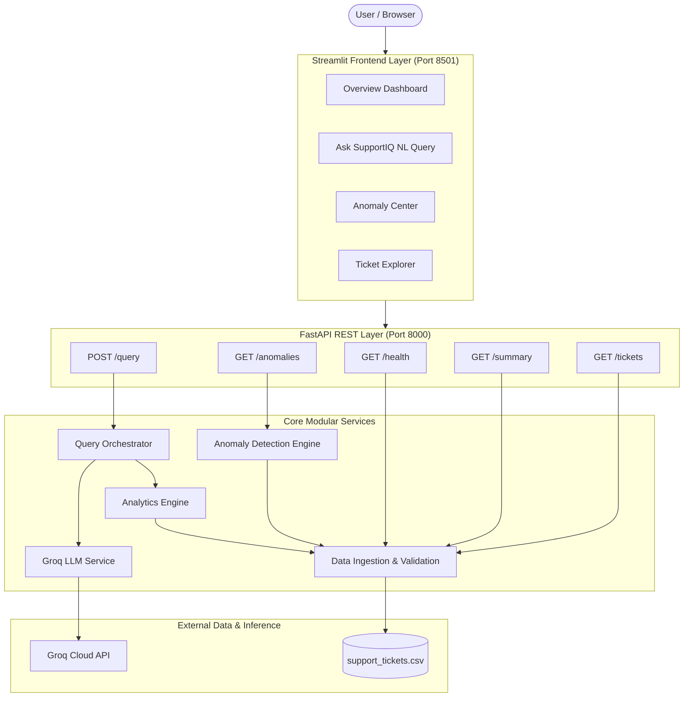

# SupportIQ 🛡️ — AI Customer Support Ticket Intelligence Platform

> **DOTMappers AI Engineer Assessment Solution**  
> A production-grade, Python-based AI platform that ingests customer support ticket data, answers natural language analytical questions using Groq Cloud LLM query planning, detects explainable business and statistical anomalies, and provides both a REST API and Streamlit UI.

---

## 1. Project Overview

**SupportIQ** is an end-to-end AI analytics system designed to analyze customer support operations deterministically while leveraging LLMs for natural language understanding. By decoupling language understanding (handled by Groq's fast LLM inference) from data calculations (executed deterministically via Pandas), SupportIQ guarantees zero hallucinations, high accuracy, and zero execution safety risks.

---

## 2. Problem Statement & Business Value

Modern customer support teams struggle to extract real-time operational insights from raw support logs. Direct LLM generation over CSV datasets leads to math hallucinations, missing null-value handling, security vulnerabilities, and unpredictable answers. 

**SupportIQ solves this by:**
- Translating free-form user questions into controlled JSON query plans validated by Pydantic.
- Computing exact metrics (averages, counts, top agents, resolution bottlenecks) deterministically using Pandas.
- Flagging operational anomalies (SLA breaches, aging unresolved critical issues, low satisfaction scores, statistical resolution outliers) with transparent explanations.
- Providing operational clarity via interactive REST API endpoints and a Streamlit UI dashboard.

---

## 3. Feature List

- 📊 **Executive Dashboard**: Key metrics (total tickets, unresolved count, critical alerts, avg customer satisfaction), interactive Plotly status pie charts, priority bar charts, and category breakdowns.
- 💬 **Natural Language Query Interface**: Translates free-form English questions into controlled `QueryPlan` schemas and returns verified answers with evidence.
- 🚨 **Explainable Anomaly Engine**: Detects 5 distinct anomaly types with configurable thresholds and transparent explanations.
- 🔍 **Support Ticket Explorer**: Filter, search, and paginate through ticket records.
- ⚙️ **System Diagnostic & Health Check**: Real-time monitoring of dataset loading, row count, and Groq API status.
- 🔒 **Zero Code Execution Security**: No LLM-generated Python or SQL code is ever executed.

---

## 4. System Architecture



---

## 5. Technology Stack

- **Core Language**: Python 3.10+
- **Backend API Framework**: FastAPI, Uvicorn
- **Frontend UI Framework**: Streamlit, Plotly
- **Data Analytics & Operations**: Pandas, NumPy
- **LLM Provider & SDK**: Groq Cloud SDK (`groq`), Model: `llama-3.3-70b-versatile`
- **Schema Validation & Settings**: Pydantic V2, Pydantic-Settings
- **Testing & Quality Assurance**: pytest, TestClient

---

## 6. Project Folder Structure

```
.
├── app/
│   ├── __init__.py
│   ├── main.py                 # FastAPI entry point & routers
│   ├── config.py               # Application & environment settings
│   ├── schemas.py              # Pydantic request/response models
│   ├── dependencies.py         # Service dependency injection
│   ├── services/
│   │   ├── __init__.py
│   │   ├── data_service.py     # CSV loading & schema validation
│   │   ├── analytics_service.py # Deterministic Pandas analytics engine
│   │   ├── llm_service.py      # Groq LLM query planning & prompt logic
│   │   ├── query_service.py    # Query orchestration & natural answer formatter
│   │   └── anomaly_service.py  # Explainable anomaly detection engine
│   └── utils/
│       ├── __init__.py
│       ├── logging_config.py   # Application logging setup
│       └── date_utils.py       # Datetime parsing helpers
├── data/
│   └── support_tickets.csv     # 500-row customer support dataset
├── frontend/
│   └── streamlit_app.py        # Streamlit dashboard interface
├── tests/
│   ├── __init__.py
│   ├── test_data_service.py    # Unit tests for data loading & schema checks
│   ├── test_analytics.py       # Unit tests for analytical operations
│   ├── test_llm_service.py     # Unit tests for Groq planner & mock LLM fallback
│   ├── test_query_service.py   # Unit tests for query orchestration
│   ├── test_anomalies.py       # Unit tests for anomaly rules & null handling
│   └── test_api.py             # FastAPI integration tests
├── docs/
│   └── architecture.md         # Detailed architectural design document
├── .env.example                # Environment variable template
├── .gitignore                  # Git ignore rules
├── pytest.ini                  # Pytest configuration
├── requirements.txt            # Python dependencies
├── README.md                   # Complete system documentation
└── run.sh                      # Single-command application startup script
```

---

## 7. Prerequisites

- Python 3.10 or higher
- Git
- Free Groq Cloud API Key (Get a free key at [console.groq.com](https://console.groq.com/))

---

## 8. Installation Steps

1. **Clone the repository**:
   ```bash
   git clone https://github.com/harishrobin11/AI_Intern_Assessment.git
   cd AI_Intern_Assessment
   ```

2. **Create and activate a virtual environment**:
   ```bash
   python3 -m venv venv
   source venv/bin/activate
   ```

3. **Install dependencies**:
   ```bash
   pip install -r requirements.txt
   ```

4. **Configure environment variables**:
   ```bash
   cp .env.example .env
   ```
   Edit `.env` and set your `GROQ_API_KEY`:
   ```ini
   GROQ_API_KEY=gsk_your_actual_groq_api_key_here
   GROQ_MODEL=llama-3.3-70b-versatile
   DATA_PATH=data/support_tickets.csv
   ```

---

## 9. Environment Variables

| Variable | Default Value | Description |
| :--- | :--- | :--- |
| `GROQ_API_KEY` | *(Required)* | Groq Cloud API Key |
| `GROQ_MODEL` | `llama-3.3-70b-versatile` | Groq LLM model name |
| `DATA_PATH` | `data/support_tickets.csv` | Path to CSV dataset |
| `API_HOST` | `0.0.0.0` | FastAPI server host |
| `API_PORT` | `8000` | FastAPI server port |
| `API_BASE_URL` | `http://localhost:8000` | Base URL used by Streamlit UI |

---

## 10. How to Run Single-Command Startup

Start both the FastAPI backend and Streamlit frontend simultaneously with one command:

```bash
./run.sh
```

---

## 11. How to Run API & UI Separately

**FastAPI Backend Server**:
```bash
source venv/bin/activate
uvicorn app.main:app --host 0.0.0.0 --port 8000 --reload
```
*API Swagger Documentation available at*: `http://localhost:8000/docs`

**Streamlit Dashboard UI**:
```bash
source venv/bin/activate
streamlit run frontend/streamlit_app.py --server.port 8501
```
*Access UI at*: `http://localhost:8501`

---

## 12. API Endpoint Reference

| Method | Endpoint | Description |
| :--- | :--- | :--- |
| `GET` | `/health` | Check API status, dataset row count, and Groq configuration status |
| `GET` | `/summary` | Get dataset metrics breakdown (totals, status, priority, averages) |
| `POST` | `/query` | Natural language query interface (converts question -> plan -> result) |
| `GET` | `/anomalies` | Retrieve flagged operational and statistical anomalies with explanations |
| `GET` | `/tickets` | Search and filter support ticket records with pagination |

---

## 13. Supported Natural-Language Query Scope

The query engine supports analytical operations across allow-listed fields (`ticket_id`, `created_at`, `category`, `priority`, `status`, `response_time_hrs`, `resolution_time_hrs`, `agent_id`, `customer_rating`):

- **Count operations**: "How many tickets are currently open?", "Count unresolved high priority tickets"
- **Average calculations**: "What is the average customer rating for Technical tickets?"
- **Min / Max metrics**: "What is the maximum resolution time for Critical tickets?"
- **Sum metrics**: "What is the total resolution time spent on Billing issues?"
- **Rankings & Top N**: "Which agent resolved the most tickets?", "What are the top three categories by ticket volume?"
- **Filtered listing / SLA breaches**: "Show Critical tickets not resolved within 12 hours"

---

## 14. Example Questions & Real System Outputs

### Example 1: Count Query
**Question**: `"How many tickets are currently open?"`  
**API Request**: `POST /query` `{"question": "How many tickets are currently open?"}`  
**Real Output**:
```json
{
  "question": "How many tickets are currently open?",
  "query_plan": {
    "operation": "count",
    "metric": null,
    "group_by": null,
    "filters": {"status": "Open"},
    "limit": 20,
    "explanation": "Count open tickets"
  },
  "result": {
    "operation": "count",
    "value": 122,
    "record_count": 122
  },
  "answer": "There are 122 tickets matching your request (status='Open')."
}
```

### Example 2: Metric Average Query
**Question**: `"What is the average customer rating for Technical tickets?"`  
**Real Output**:
```json
{
  "question": "What is the average customer rating for Technical tickets?",
  "query_plan": {
    "operation": "average",
    "metric": "customer_rating",
    "group_by": null,
    "filters": {"category": "Technical"},
    "limit": 20,
    "explanation": "Calculate average customer_rating for Technical category"
  },
  "result": {
    "operation": "average",
    "metric": "customer_rating",
    "value": 3.74,
    "record_count": 104
  },
  "answer": "The average customer rating for category='Technical' is 3.74 (based on 104 records)."
}
```

### Example 3: Agent Ranking Query
**Question**: `"Which agent resolved the most tickets?"`  
**Real Output**:
```json
{
  "question": "Which agent resolved the most tickets?",
  "query_plan": {
    "operation": "top_n",
    "metric": "ticket_count",
    "group_by": "agent_id",
    "filters": {"status": "Resolved"},
    "limit": 1,
    "explanation": "Find agent with the highest count of resolved tickets"
  },
  "result": {
    "operation": "top_n",
    "group_by": "agent_id",
    "value": [{"agent_id": "AGT-09", "count": 37}]
  },
  "answer": "The top agent id is 'AGT-09' with 37 resolved tickets (status='Resolved')."
}
```

### Example 4: Filtered SLA Breach Query
**Question**: `"Show Critical tickets not resolved within 12 hours."`  
**Real Output**:
```json
{
  "question": "Show Critical tickets not resolved within 12 hours.",
  "query_plan": {
    "operation": "filter",
    "metric": null,
    "group_by": null,
    "filters": {"priority": "Critical", "min_resolution_time_hrs": 12.0},
    "limit": 20,
    "explanation": "Filter Critical priority tickets with resolution time over 12 hours"
  },
  "result": {
    "operation": "filter",
    "record_count": 16,
    "returned_count": 16
  },
  "answer": "Found 16 ticket(s) matching your request. Showing top 16 records."
}
```

### Example 5: Unsupported Question Fallback
**Question**: `"What will the company stock price be next month?"`  
**Real Output**:
```json
{
  "question": "What will the company stock price be next month?",
  "query_plan": {
    "operation": "unsupported",
    "explanation": "The requested question is outside the supported analytics scope."
  },
  "result": {"value": null, "record_count": 0, "status": "unsupported"},
  "answer": "The requested question is outside the supported analytics scope.\n\nSupportIQ supports natural language queries covering:\n• Ticket counts...\n• Metrics & averages...\n• Agent rankings..."
}
```

---

## 15. Anomaly Rules & Thresholds

SupportIQ implements 5 transparent business and statistical anomaly rules:

1. **`critical_unresolved`**: Critical priority tickets that remain Open or Escalated.
   - *Threshold*: `status in ['Open', 'Escalated']` & `priority == 'Critical'`
   - *Severity*: Critical
2. **`aging_unresolved`**: High or Critical priority tickets unresolved for > 24 hours.
   - *Threshold*: `24.0` hours
   - *Severity*: High
3. **`resolution_time_outlier`**: Resolution times exceeding upper statistical bound \(Q3 + 1.5 \times \text{IQR}\).
   - *Threshold*: Computed upper IQR bound (e.g. `23.8` hours)
   - *Severity*: Medium
   - *Note*: Unresolved tickets with `null` resolution times are excluded to avoid false positives.
4. **`low_customer_rating`**: Customer satisfaction rating \(\le 2.0\).
   - *Threshold*: `2.0`
   - *Severity*: Medium
5. **`slow_first_response`**: First agent response time exceeding SLA threshold.
   - *Threshold*: `4.0` hours
   - *Severity*: Low

---

## 16. LLM Prompt & Validation Approach

- **System Persona**: Query-planning assistant restricted strictly to converting user questions into a structured `QueryPlan` JSON schema.
- **Strict JSON Enforcement**: Prompt prohibits markdown block wrappers and raw text.
- **Pydantic Validation**: All output is parsed into a Pydantic model (`QueryPlan`). Invalid operations, fields, or filter values fail validation cleanly.
- **No Arbitrary Execution**: The model is forbidden from returning code or calculating math. Python executes all calculations deterministically.

---

## 17. Testing Instructions & Results

Run the complete test suite using pytest:

```bash
source venv/bin/activate
pytest tests/ -v
```

### Test Suite Execution Summary:
- `tests/test_data_service.py`: 4 passed (missing CSV, malformed schema, data types, null preservation)
- `tests/test_analytics.py`: 6 passed (count, average, top agent, SLA breach filters, group count)
- `tests/test_llm_service.py`: 4 passed (missing API key, valid query plan generation, invalid JSON handling, 429 rate limit error handling)
- `tests/test_query_service.py`: 3 passed (end-to-end question processing, average rating, unsupported fallback)
- `tests/test_anomalies.py`: 6 passed (critical unresolved, IQR outliers, low ratings, slow response, null handling)
- `tests/test_api.py`: 6 passed (GET /health, GET /summary, POST /query, GET /anomalies, GET /tickets)

**Total Test Results**: `29 passed in 2.88 seconds` ✅

---

## 18. Known Limitations

1. **Defined Analytical Scope**: The system supports structured analytical operations (count, average, sum, min/max, group_by, top_n, filter) rather than unconstrained general prose generation.
2. **Static CSV Source**: Currently ingests data from a static CSV file (`support_tickets.csv`).
3. **External Free-Tier Dependency**: Groq API rate limits apply under heavy concurrency.
4. **Heuristic Anomaly Detection**: Anomaly rules use transparent heuristics and flag records for human review rather than performing predictive ML.

---

## 19. Future Improvements

1. **Database Backend**: Replace CSV ingestion with PostgreSQL or Snowflake data warehouse support.
2. **Dynamic Date Expressions**: Add relative date parser for phrases like "last week", "this quarter".
3. **LLM Observability**: Integrate LangSmith or Phoenix for prompt versioning and latency tracking.
4. **Role-Based Access Control (RBAC)**: Add JWT authentication for API and dashboard access.

---

## 20. 30-Minute Architecture Walkthrough Preparation Q&A

### Q1: Why did you choose Groq for LLM inference?
> **Answer**: Groq provides hosted LLM inference with ultra-fast generation speeds and a free plan. This allows zero-cost execution for evaluators without running heavy local GPU models.

### Q2: Why not ask the LLM to answer directly from the CSV data?
> **Answer**: Direct LLM generation over CSVs causes hallucinated numbers, incorrect averages, and null-handling bugs. By using the LLM strictly as a query planner and running Pandas for calculation, results are 100% accurate, reproducible, and verifiable.

### Q3: How do you prevent unsafe LLM outputs?
> **Answer**: The model is restricted to a Pydantic schema (`QueryPlan`). Fields, operations, and filter values are checked against strict allow-lists. Arbitrary Python code or SQL generated by LLMs is never executed.

### Q4: How are anomalies detected?
> **Answer**: SupportIQ uses transparent business rules for critical unresolved and aging tickets, along with a statistical IQR rule (\(Q3 + 1.5 \times \text{IQR}\)) for resolution time outliers. Null resolution times are preserved so unresolved tickets are not misflagged.

---

*Submitted for the DOTMappers AI Engineer Assessment*
