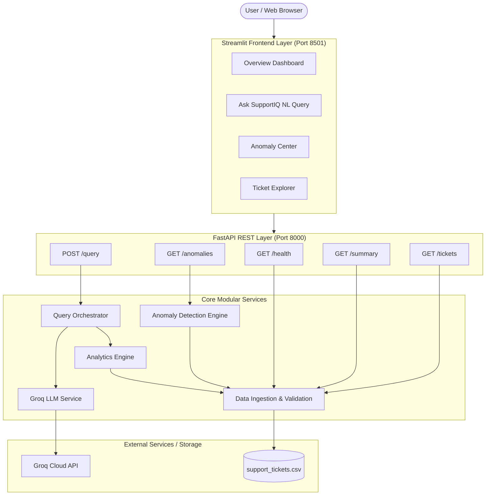

# SupportIQ Architecture Documentation

## Overview

SupportIQ is an AI-powered customer support ticket analytics and explainable anomaly detection platform built with Python, FastAPI, Pandas, Streamlit, and Groq Cloud hosted LLM inference.

The core architectural principle of SupportIQ is **strict separation between natural language understanding and deterministic data calculation**. The system uses the Groq LLM purely to translate unstructured user questions into a validated, structured `QueryPlan` JSON object. Computation is executed deterministically by a Pandas-powered analytics engine, eliminating LLM hallucinations, math errors, and security risks associated with code generation.

---

## High-Level System Architecture

---

## Component Breakdown

### 1. Data Ingestion & Schema Validation (`app/services/data_service.py`)
- Loads `support_tickets.csv` on application startup.
- Validates all 10 required schema columns (`ticket_id`, `created_at`, `category`, `priority`, `status`, `response_time_hrs`, `resolution_time_hrs`, `agent_id`, `customer_rating`, `issue_summary`).
- Parses `created_at` as datetime.
- Coerces numeric fields safely (`response_time_hrs`, `resolution_time_hrs`, `customer_rating`).
- Preserves `NaN` / `None` for unresolved tickets.
- Exposes summary statistics and health status metrics.

### 2. Groq LLM Query Planner (`app/services/llm_service.py`)
- Interfaces with Groq API using `groq` Python SDK (default model: `llama-3.3-70b-versatile`).
- System prompt restricts model output strictly to JSON conforming to `QueryPlan` Pydantic schema.
- Enforces strict allow-lists for operations, metrics, and filter values.
- Gracefully handles missing API keys, rate limits (HTTP 429), and JSON parsing errors.

### 3. Deterministic Analytics Engine (`app/services/analytics_service.py`)
- Performs safe, deterministic data aggregations using Pandas:
  - `count`, `average`, `sum`, `min`, `max`
  - `group_count`, `group_average`, `top_n`
  - `filter` / `list_records`
- Excludes `null` ratings and resolution times from averages.

### 4. Explainable Anomaly Detection Engine (`app/services/anomaly_service.py`)
- Detects 5 distinct business and statistical anomalies:
  1. `critical_unresolved`: Critical priority tickets that remain Open or Escalated.
  2. `aging_unresolved`: High/Critical priority tickets unresolved for > 24 hours.
  3. `resolution_time_outlier`: Resolution times above \(Q3 + 1.5 \times \text{IQR}\).
  4. `low_customer_rating`: Customer ratings \(\le 2.0\).
  5. `slow_first_response`: Response times exceeding 4.0 hours SLA.
- Provides human-readable explanations, detected values, and exact threshold criteria.

### 5. FastAPI Service Layer (`app/main.py`)
- Exposes OpenAPI documented endpoints.
- Implements CORS, Pydantic request/response validation, and HTTP error handling.

### 6. Streamlit Frontend Dashboard (`frontend/streamlit_app.py`)
- Interactive Plotly charts, KPI metrics, question interface, anomaly center, and ticket explorer.
- Includes automatic fallback to local Python services if the REST API server is offline.

---

## Security & Validation Controls

- **No Code Execution**: Neither Python code nor SQL queries generated by the LLM are ever executed.
- **Allow-List Scoping**: All metric fields, group-by dimensions, operations, and filter categories are validated against strict allow-lists.
- **Secret Protection**: API keys are managed via environment variables and never logged or exposed in HTTP responses.
